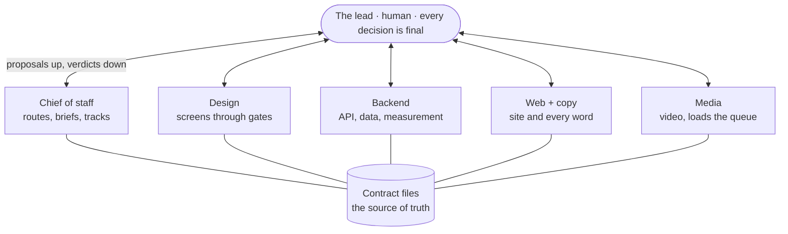

# Claude Code Team Playbook

I run five **Claude Code** sessions as a standing team: each one owns a lane, they coordinate through shared files, and nothing ships until I sign off. This repo is the operating model behind that team, written up so anyone can copy it.

## What's in this repo

| Path | What it covers |
|---|---|
| [`docs/01-operating-model.md`](docs/01-operating-model.md) | Seats with lanes, one human lead, how a session starts and restarts |
| [`docs/02-handoff-briefs.md`](docs/02-handoff-briefs.md) | The one brief every seat opens first, and what goes in it |
| [`docs/03-contract-files.md`](docs/03-contract-files.md) | Files as the source of truth, and the quiet protocol for messages |
| [`docs/04-gates-and-sign-off.md`](docs/04-gates-and-sign-off.md) | Numbered gates, redlines, and the tap that nothing skips |
| [`docs/05-laws.md`](docs/05-laws.md) | The standing rules every seat follows, and how a new one gets logged |
| [`docs/06-decision-log.md`](docs/06-decision-log.md) | Every decision dated and attributed |
| [`docs/07-skills.md`](docs/07-skills.md) | The skills the team uses, where they come from, and how they were vetted |
| [`docs/08-lessons-learned.md`](docs/08-lessons-learned.md) | What broke, and the rule each failure left behind |
| [`templates/`](templates/) | A `CLAUDE.md` skeleton, a handoff brief, a team charter, a contract file and a decision-log entry |

Every sample uses a made-up product: **Potluck**, a small web app for planning group dinners.

## **The Model in Six Rules**
- **One lead decides.** Sessions propose. Anything a seat locks is provisional until the lead says yes.
- **Every seat owns a lane.** Five seats, five lanes, and a seat that is unsure of its lane asks before it touches anything.
- **Files are the protocol.** A seat that needs to know something reads a file. Chat is for handoffs, verdicts and blockers.
- **Work moves through gates.** Each gate has a deliverable, a review and a named way to close it.
- **Nothing ships, posts or publishes without the lead's tap.** Seats load queues. The lead releases.
- **Results are the measure.** Hours spent and subagents spun up count for nothing on their own.

**Why five seats**

The count came from running more and cutting back. Two sessions sharing a lane produce two versions of the truth, and every reader has to guess which one is current. One seat per lane removes the guess.

**Why files instead of chat**

A message dies at the next context boundary. A file survives restarts, can be read by any seat at any time, and costs nothing to the seats that do not need it. Five sessions chatting burn each other's context. Five sessions reading files run in parallel without colliding.

**Why the lead's words go in verbatim**

A paraphrase loses the thing that made it a decision. Every verdict lands in its owning file, quoted, dated and attributed, the same turn it is given.

---

## Using This Playbook

1. Copy [`templates/CLAUDE.md`](templates/CLAUDE.md) to your repo root and fill in the charter.
2. Write one [`HANDOFF-<seat>.md`](templates/HANDOFF-seat.md) per seat. Count them against the charter before opening a single session.
3. Create the contract files empty on day one, each with its status block. Retrofitting them later is much harder.
4. Open one Claude Code session per seat and give each the same opening line: **"Read your handoff document and get started."**
5. Read [`docs/08-lessons-learned.md`](docs/08-lessons-learned.md) before the first week. Every failure in it happened, and a new team should expect them.

## About

I'm [Carter Hanford](https://www.linkedin.com/in/carter-hanford), a Product Owner in St. Louis, and I run this team day to day. The companion repo, [claude-context-library](https://github.com/carter-hanford/claude-context-library), is a personal knowledge base Claude keeps honest: raw notes in, a cited wiki out.

MIT licensed. Copy anything.
